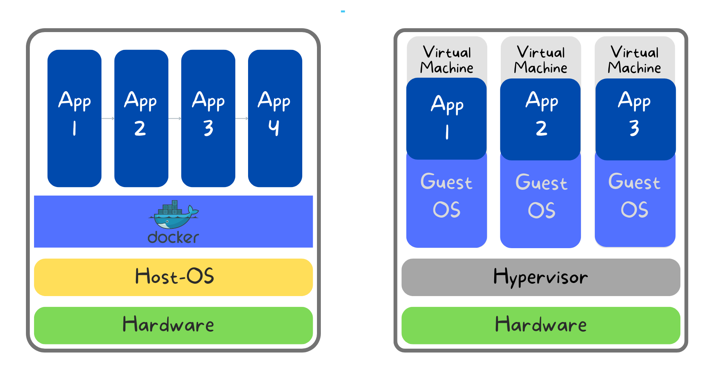
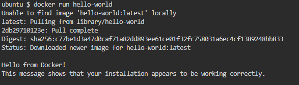
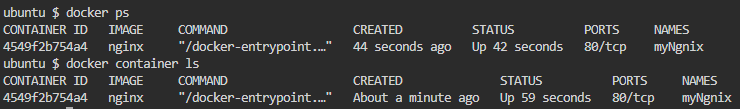

# Introduction: What is Docker, and Why is it so Important?

In simple words, Docker is a tool that allows developers, sys-admins, etc., to easily deploy their applications in containers to run on the host operating system, i.e. Linux.

The primary advantage of Docker is that it enables developers to **compile a program and all of its dependencies into a single, standardized unit** for software development. It allows developers to package and distribute their applications fast, consistently, and reliably. It also makes it easy to run those applications in various environments, such as on a developer's local machine, in a testing environment, or in a production environment.  
Docker also makes it easier to scale applications, as containers can be easily moved from one host to another.

## What was before Docker?

Not Docker in particular, but before containers, there were operating system virtualization, chroot, and resource isolation.  
OS-virtualization, which involves creating multiple virtual environments(VMs) on a single physical host. Which can run their own operating systems and applications and are isolated from each other. Operating system virtualization has been around for decades and is still in use today.  
Another technology that preceded containers is chroot, which allows a user to change the root directory for a process and its children. This can be used to isolate a process and its dependencies from the rest of the system.  
Overall, containers build upon these and other technologies and concepts to provide a lightweight and portable way to isolate and run applications.



## Advantages of Docker

Containers have several advantages over prior technologies, such as they are more **Lightweight**, **Portable**, and **Isolated.** Containers also allow developers to package and distribute applications **consistently**, making it easier to develop and test applications. It can be easily **automated**, which can save time and reduce the risk of errors when building, testing, and deploying applications.

Overall, containers offer a lightweight and efficient way to isolate and run applications, making them an attractive option for developers.

# Let's do a hands-on on Docker containers.

To work with Docker, it is not necessary to know the Docker architecture or how Docker works \[[You can see that here](https://docs.docker.com/get-started/overview/#:~:text=Docker%20architecture,to%20a%20remote%20Docker%20daemon.).\], but we need to understand some of the terms.

1.  **Image**: A Docker image is a lightweight, standalone, and executable package that includes everything an application needs to run, including the application code, libraries, dependencies, and runtime.
    
2.  **Container**: A Docker container is a running instance of a Docker image. A container allows an application to be run in a lightweight, isolated environment.
    
3.  **Registry**: A Docker registry is a centralized storage location for Docker images. Docker provides a free public registry called Docker Hub, which allows users to store and distribute their images.
    
4.  **Dockerfile**: A Dockerfile is a text file that contains the instructions for building a Docker image. It specifies the base image, the dependencies, and the commands needed to run the application.
    

Let's run the first command.

```bash
docker run hello-world
```

If your system is running Docker properly, you should have an output saying, "Hello from Docker!"



`docker run <IMAGE_NAME>` is just spinning up containers of the specified image.

You can also see the 2<sup>nd</sup> and the 3 <sup>lines</sup> where the docker first searches for the image locally, and if it is unable to find it, it goes and look at the DockerHub and pull the image from there.

There are many flags we can use in the `docker run` like `--name <CONTAINER_NAME>` that will give a specified name to the container, which we can use to refer to instead of the container ID; we also use the `-d` flag which will run the container in the background and print out the container ID.

But you might ask, Hey Debasish, what do you mean by background? Where is the information about containers running in the background? How can I access them?

Trust me, we will explore that.

```bash
docker run -d --name myNginx nginx
```

This command will run a container in the background with the name "myNginx". If you remove the \`-d' flag, you will see that the terminal has frozen. Because the container will take over the terminal.

Now, if you run `docker container ls`, you can see the information about all the running containers(you can also use `docker ps`). Container ID, image name, status, ports, and container name.



Ok, so my Ngnix server is running, but how can I access it? Can I simply curl `http://localhost:80`? If you try this, you will not get any response. Now you may say, "hey Debasish though my Nginx server is running, why wouldn't I be able to use it? Or how can I access my Nginx server?"

The answer is that the container is running on our local machine, but the Nginx server we are trying to access is actually running inside the container. **A container is not the server or the application we will run on the Docker but the isolated environment where our applications or servers will run**. So we will be able to access the server from inside the container.

So, how can we go inside the container?

```bash
docker exec -it myNginx bash
```

Booom, we are inside the container, and your terminal initials will look like `root@<container_id>:/#`. Now you can `curl http://localhost:80`, and we will get the raw nginx home page as a response from the server.

Here `docker exec <container_id> <command>` will run the specified command inside the corresponding container, and `-it` is for an interactive terminal, so after opening the container's bash shell, we will stay inside. We can also run any command and open any other available shell, i.e., sh, bash etc.

There is another way to access any serving port from outside the container, and we can poke a hole into the container, publish port no inside the container, and forward it to an external port. We can do it while starting the container.

Let's stop the running container first by running.

```bash
docker container stop myNginx
```

Now let's start the container again while publishing container port 80 to port 8080 into our local machine.

```bash
docker run -d -p 8080:80 --name portNginx nginx
```

`-p <host_port_no>:<container_port_no>` now we can access the Nginx home page by requesting http://localhost:8080. It will forward the request to the container port `80` and get back the response from there.

There are also some basic commands like

1.  `docker search`: Search the Docker Hub for images. Use the docker search command followed by the search term.
    
    ```bash
    docker search ubuntu
    ```
    
2.  `docker pull`: To pull an image or a repository from a registry, use the `docker pull` command followed by the image or repository name.
    
    ```bash
    docker pull ubuntu:18.04
    ```
    
3.  `docker stop`: To stop a running container, use the `docker stop` command followed by the container name or ID.
    
    First, we start the container by `docker run --name my-container ubuntu:18.04`
    
    ```bash
    docker stop my-container 
    ```
    
4.  `docker start`: To start a stopped container, use the `docker start` command followed by the container name or ID.
    
    ```bash
    docker start my-container
    ```

5.  `docker rm`: To remove one or more containers, use the docker rm command followed by the container name or ID.
    
    ```bash
    docker rm my-container
    ```
    We need to use `-f` to remove a running container forcefully.

6.  `docker rmi` : To remove one or more images, use the `docker rmi` command followed by the image name or ID.
    
    ```bash
    docker rmi ubuntu:18.04
    ```
    
